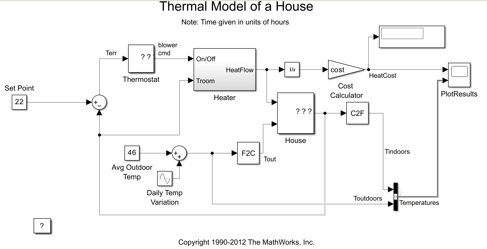

1. Write the following commands in Command Window:
   sldemo_househeat_data <enter>
   open('sldemo_househeat.slx') <enter>
this will load all parameters and open simulation
2. Once Simulink is open go to -> Modeling -> Model Settings and set these values as this:

3. Remove the F2C block:

4. Click the run button and open -> PlotResults block:

4. Now for this test 7th variant was choosen from the 1.Pielikums table (Table values: (Indoor temperature: 22°C, Budget: $80, Outdoor temperature: -11°C)). Now change the Set Point value to 22, then add the following block: Simulation -> Library Browser -> Simulink -> Sinks -> Display. Then connect this Display to "cost" block. Then change the Avg Outdoor Temp to 46.

5. Now run this simulation multiple times with various temperature changes, results table for 7th variant:  

| Indoor Temp | Outdoor Temp | Cost $ |
|-------------|--------------|-------|
| 22          | 46           | 39.91 |
| 22          | 39           | 51.18 |
| 22          | 32           | 62.4  |
| 22          | 25           | 73.54 |
| 22          | 18           | 86.01 |
| 22          | 10           | 98.42 |

6.Now we use this data to predict temperatures with budget constraints. For Variant 7, we have a budget of $80.
Looking at table data:

At -8°C (18) outdoor: cost is $86.01 (over budget)
At -4°C (25) outdoor: cost is $73.54 (under budget)

So the limit is somewhere between -8°C (18) and -4°C (25).
7. With Outdoor Temp of 21 the cost is $80.65 is very close to the target budget of $80. Let's calculate the error:
Predicted outdoor temperature: -6.1°C (21°F)
Experimental cost: $80.65
Target budget (Cd): $80.00
Error calculation: |($80.65 - $80.00) / $80.00| × 100% = 0.81%
| Task | Indoor Temp (°C) | Budget ($) | Outdoor Temp (°C / °F) | Error |
|------|------------------|------------|------------------------|-------|
| 4    | 22               | 80         | -6.1 / 21              | 0.81% |
8. Now we need to find what indoor temperature we can maintain with a $80 budget when outdoor temperature is fixed at -11°C (Variant 7's specified outdoor temp). !Keep error under 5%
Answer: With Set Point 17 and Avg Outdoor Temp of 12 I the cost is 79.18, which is closer to $80.

| Task | Indoor Temp (°C) | Budget ($) | Outdoor Temp (°C / °F) | Error |
|------|------------------|------------|------------------------|-------|
| 5    | 17               | 80         | -11 / 12               | 1.03% |
9. Now for the last task:

Modified Relay Function for Air Conditioning:
Mathematical Expression:
u(t) = { 0  when ΔT > 2.7778°C   (room cool enough, cooling OFF)
       { 1  when ΔT < -2.7778°C  (room too hot, cooling ON)
Where ΔT = T_setpoint - T_room
In Fahrenheit terms (original):
u(t) = { 0  when ΔT > 5°F   (cooling OFF)
       { 1  when ΔT < -5°F  (cooling ON)
Implementation Changes Made:

Switch on point: 2.7778°C (kept same)
Switch off point: -2.7778°C (kept same)
Output when on: 0 (changed from 1)
Output when off: 1 (changed from 0)

Results:

Air conditioning cost: $104.4 for 2 days
System behavior: Successfully maintains temperature by cooling
Cost comparison: Higher than heating costs (~$60-98), which is expected for cooling systems

What Happened
Original System (Tasks 1-5):

House gets cold → Heater turns ON → Adds heat to warm the house
House gets warm enough → Heater turns OFF

Modified System (Task 6):

House gets hot → Air conditioner turns ON → Removes heat to cool the house
House gets cool enough → Air conditioner turns OFF

The Key Change
You changed the sildītājs (heater) block to work as an air conditioner/cooler by reversing when it operates:

Before: Operated when room was too cold (to heat it up)
After: Operates when room is too hot (to cool it down)

Why the Cost Increased
The cost went from ~$60-98 (heating) to $104.4 (cooling) because:

Air conditioning typically costs more than heating
The system is now removing heat instead of adding it
Cooling requires more energy to maintain the same comfort level

So yes - instead of the heater warming the house when it got cold, the system now cools the house when it gets hot! You successfully converted a heating system into an air conditioning system. 🌡️❄️
