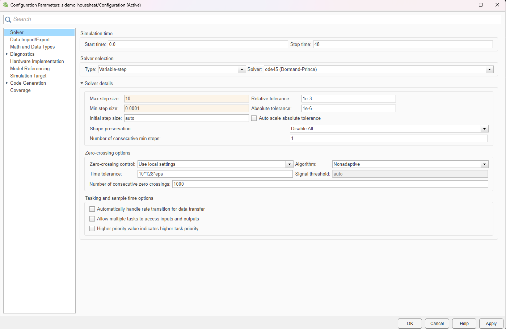
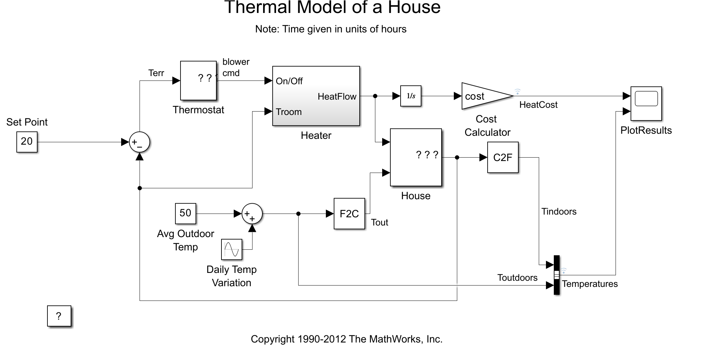
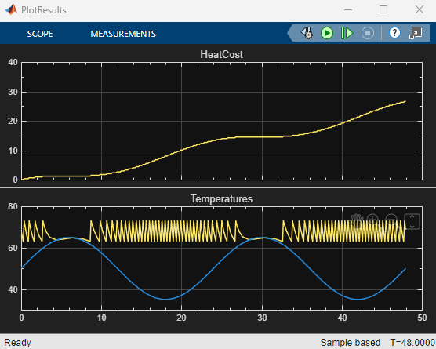
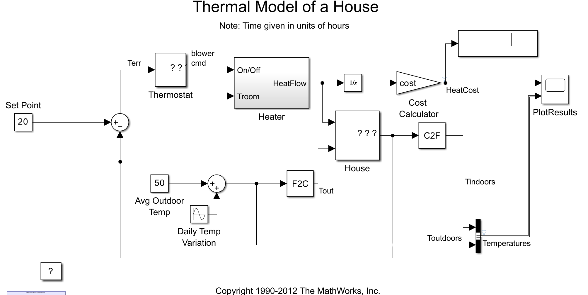

1. Write the following commands in Command Window:
   sldemo_househeat_data <enter>
   open('sldemo_househeat.slx') <enter>
this will load all parameters and open simulation
2. Once Simulink is open go to -> Modeling -> Model Settings and set these values as this:

3. Remove the F2C block:

4. Click the run button and open -> PlotResults block:

4. Now for this test 7th variant was choosen from the 1.Pielikums table (Table values: (Indoor temperature: 22°C, Budget: $80, Outdoor temperature: -11°C)). Now change the Set Point value to 22, then add the following block: Simulation -> Library Browser -> Simulink -> Sinks -> Display. Then connect this Display to "cost" block. Then change the Avg Outdoor Temp to 46.

